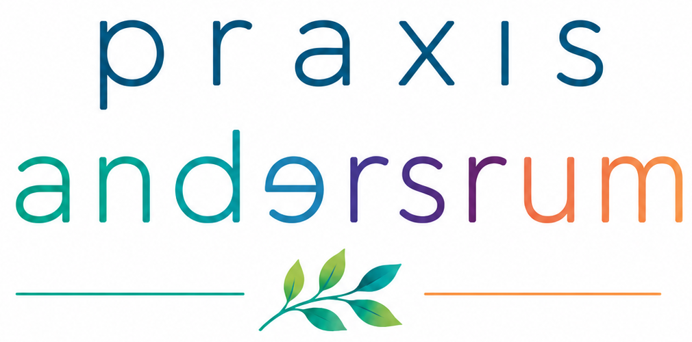
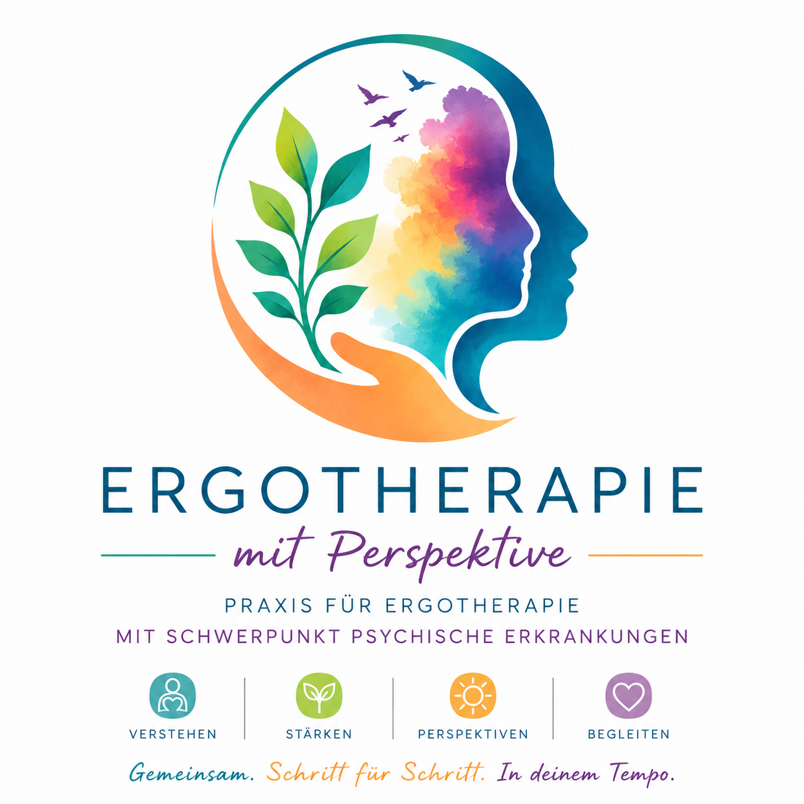
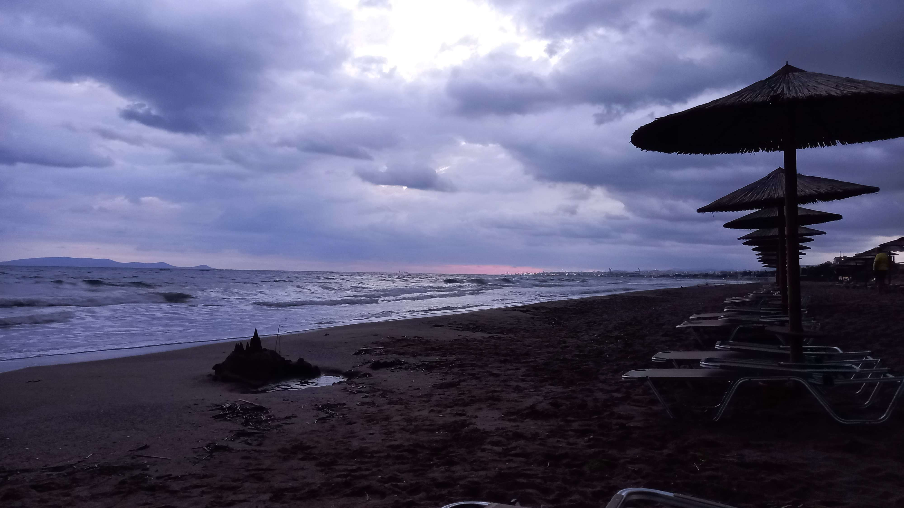
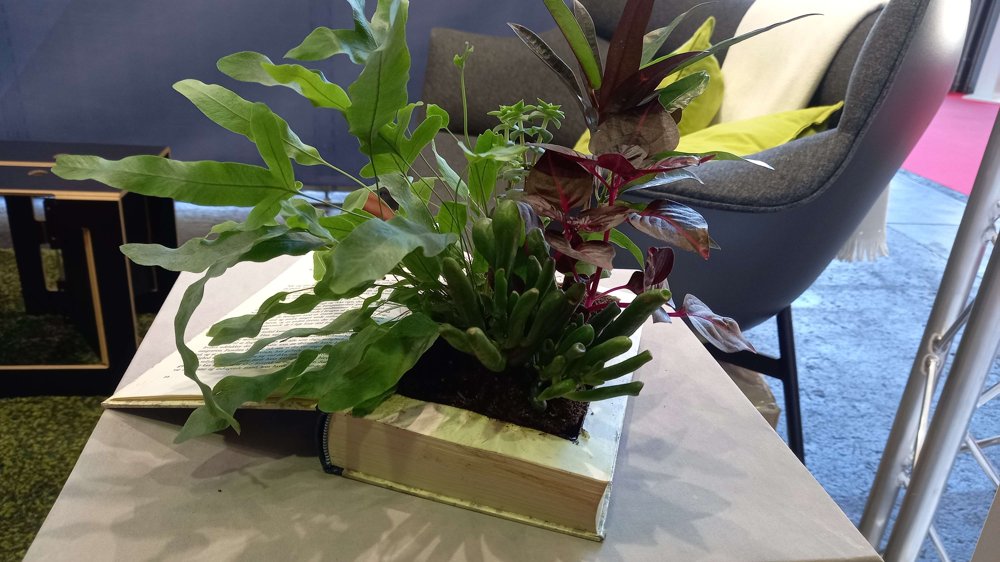
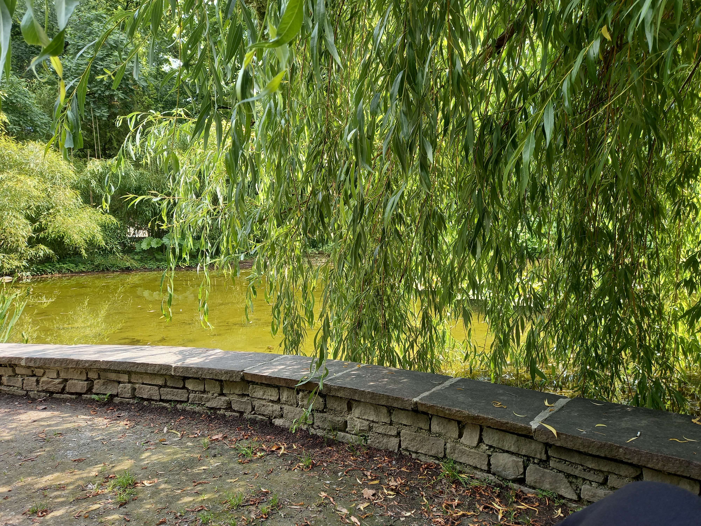

<html lang="de">
<head>
  <meta charset="UTF-8" />
  <meta name="viewport" content="width=device-width, initial-scale=1.0"/>
  <title>Barbara Weinold – Ergotherapie</title>

  <link rel="preconnect" href="https://fonts.googleapis.com">
  <link rel="preconnect" href="https://fonts.gstatic.com" crossorigin>

  <link href="https://fonts.googleapis.com/css2?family=Inter:wght@300;400;500;600;700&display=swap" rel="stylesheet">

  
</head>
<body>

  <nav>
    

       
      

        <a href="#services">Therapie</a>
        <a href="#about">Über mich</a>
        <a href="#gallery">Was ist Ergotherapie</a>
        <a href="#orga">Ablauf und Organisatorisches</a>
        <a href="#contact">Kontakt</a>
      

    

  </nav>

  <section class="hero" style="margin-top:50px">
    

      

        
      

    

  </section>
  

  <section id="services">
    

      

        

          
          

            <h3>Therapieschwerpunkte</h3>
            

              Ich arbeite mit Menschen mit psychischen Beschwerden aller Art ab ca. 18 Jahren. Zu den häufigsten Diagnosen, mit denen ich arbeite, zählen u.a.  
              •	ADHS  
              •	Autismus  
              •	Depressionen  
              •	Angst- und Panikstörungen  
              •	Suchterkrankungen  
              •	Psychosomatische Erkrankungen
            

          

        

        

          
          

            <h3>Inhaltliche Schwerpunkte in der Ergotherapie</h3>
            

            •	Emotionsregulierung erarbeiten und üben  
            •	Struktur im Alltag finden und beibehalten  
            •	Routinen erarbeiten  
            •	Bedeutungsvolle Aktivitäten im Alltag finden  
            •	Selbstwert und Selbstwirksamkeit stärken  
            •	Identitätsfindung  
            •	Umgang mit neuen Rollen und Lebensbereichen  
            •	Soziale Kompetenzen trainieren  
            •	Arbeitsfähigkeiten trainieren  
            •	Eigene Grenzen und Belastungen kennenlernen  
            •	Umgang mit Ansprüchen und Perfektionismus  
            •	Kennenlernen der eigenen Diagnose und Psychoedukation  
            •	…
            

          

        

        

          
          

            <h3>Einzeltherapie</h3>
            

              Im Einzelsetting bekommen Sie die Zeit, die Sie brauchen, um sich mit Ihrem Alltag auseinanderzusetzen. Persönliche Schwierigkeiten, aber vor allem persönliche Stärken und Ressourcen stehen im Vordergrund. Die                 Einzeltherapie findet in der Regel in meiner Praxis statt und beinhaltet u.a. Gespräche, kreative Betätigungen und Alltagstätigkeiten. 
            

          

        

        

          
          

            <h3>Hausbesuche</h3>
            

            Bei Bedarf kann die Therapie auch zu Hause bei Ihnen stattfinden oder unterwegs bei Tätigkeiten Ihres täglichen Lebens. Wichtig: Hausbesuche müssen von Ihrer Ärztin/Ihrem Arzt bereits auf der Überweisung vermerkt werden.
            

          

        

        

          
          

            <h3>Angehörigenarbeit und Vernetzung mit anderen Berufsgruppen</h3>
            

              Als Ergotherapeutin weiß ich, dass Veränderung nicht isoliert bei meinen Klient:innen stattfindet, sondern auch das soziale Umfeld beeinflusst und umgekehrt. Daher beziehe ich bei Bedarf auch die Angehörigen mit ein. Eine Vernetzung mit anderen involvierten Berufsgruppen, z.B. behandelnden Ärzt:innen, Psychotherapeut:innen oder Sozialarbeiter:innen, ist mir ebenfalls wichtig und kann bei Bedarf jederzeit erfolgen.
            

          

        

        

          
          

            <h3>Ergotherapie auf Englisch</h3>
            

              Mit einem geprüften C2 Englisch Sprachniveau (nach CAE = Cambridge Certificate in Advanced English) biete ich Ergotherapie auch auf Englisch an.
            

          

        

      

    

  </section>
  <section id="about">
    

      

        <h2 style="color: #045680">Über mich</h2>
        

          Ich bin Barbara Weinold, Ergotherapeutin mit Herz und Seele. Ich weiß aus eigener Erfahrung, wie es ist, die Welt anders zu erleben, und wie schwierig es sein kann, darin den eigenen Weg zu finden. 
        

        

          Gemeinsam mit meiner fachlichen Erfahrung aus zahlreichen Jobs in psychiatrischen Settings gelingt es mir dadurch, auf jede:n Klient:in ganz individuell einzugehen – mit Verständnis und Motivation zur Veränderung.
        

        

           Ich gehe die Ergotherapie an wie alles andere in meinem Leben: mit Energie, Authentizität und einer ordentlichen Prise Humor, auch und trotz belastender Themen, die mitgebracht werden. 
        

        

          Ich arbeite mit Jugendlichen und Erwachsenen, die im Alltag an ihre Grenzen kommen und bereit sind, gemeinsam etwas zu verändern – egal, wo diese Grenzen liegen. 
        

      

      

        

          
        

        

          <h3>Beruflicher Werdegang</h3>
          

          •	Seit 2025 Psychotherapie Station Hall, ehem. B5  
          •	2024-2025 Caravan, pro mente (Tagesstruktur für Menschen mit Suchterkrankung) - Karenzstelle  
          •	2024 VAMED Innsbruck (ambulante psychosoziale Reha)  
          •	2023-2024 Sonnenpark Lans (stationäre psychosoziale Reha) - Karenzstelle  
          •	2021-2023 Psychiatrie Innsbruck (v.a. Station für psychosomatische Medizin) - Karenzstelle  
          •	2020-2021 PKA Innsbruck (Orthopädie, Neurologie, Pädiatrie)  
          •	2017-2020 FH Studium Ergotherapie
          

        

        

          
        

        

          <h3>Fortbildungen</h3>
          

•	Neurodivergenz in der Ergotherapie (ergotherapie austria, 2026)  
•	Kreativ-Therapeutisches Schreiben in der Psychiatrie und Psychosomatik (tirol kliniken, 2026) 
•	Selbstwert – Selbstvertrauen – Selbstwirksamkeit (ergotherapie austria, 2025) 
•	Schlafcoaching (pro mente akademie, 2024) 
•	Traumasensibles Arbeiten in der Ergotherapie (ergotherapie austria, 2024) 
•	Angst- und Panikstörungen (pro mente akademie, 2024)  
•	Handeln ermöglichen – Trägheit überwinden (ergotherapie austria, 2022)
          

        

      

    

  </section>
  <section id="gallery">
    

      

        <h2 style="color: #045680">Was ist Ergotherapie</h2>
        

          Ergotherapie hilft dabei, die eigene Handlungsfähigkeit wiederherzustellen. Denn wir Menschen sind im Grunde gerne tätig – wir haben Spaß an unseren alltäglichen Betätigungen (wenn auch an manchen mehr als an anderen), wir TUN gerne. 
        

        

          Sind diese bedeutungsvollen Aktivitäten nicht (mehr) möglich, kommt es zu gesundheitlichen Einschränkungen. Gemeinsam finden wir also Mittel und Wege, wie Sie Ihren Alltag so meistern können, dass Sie wieder mehr Zufriedenheit und Lebensqualität erleben können. 
        

        

          Das beinhaltet neben dem Training von persönlichen Fähigkeiten auch Adaptierungen Ihrer Betätigungen und Ihrer Umwelt, denn das alles spielt bei Beeinträchtigungen eine Rolle. 
        

      

    

  </section>
  <section id="orga" style="text-align:left">
    

      

        <h2 style="color: #045680">Ablauf und Organisatorisches</h2>
        

          Bevor Sie zu mir kommen, benötigen Sie eine Überweisung von Ihrer/Ihrem Haus- oder besser Ihrer/Ihrem Facharzt/-ärztin. Auf der Überweisung steht die Anzahl der Ergotherapie-Einheiten, die Dauer einer Einheit und ob Sie diese als Hausbesuche benötigen. 
        

        

          Mit dieser Überweisung melden Sie sich bei mir und wir vereinbaren einen Termin für das Erstgespräch. Darin entscheiden wir gemeinsam, woran wir in der Ergotherapie arbeiten und in welchem Abstand die Einheiten stattfinden. 
        

        

          Ich bin Wahltherapeutin, das bedeutet, dass Sie am Ende jeder Einheit direkt bei mir in der Praxis bezahlen (in bar oder mit Karte) und die Rechnung im Anschluss selbst bei Ihrer Krankenkassa einreichen. Von der Krankenkassa erhalten Sie dann einen Anteil der Kosten rückerstattet. 
        
 
        

          <h3>Kosten</h3>
          
Die Dauer einer Ergotherapie-Einheit wird von der/vom zuständigen Arzt/Ärztin bereits auf die Überweisung geschrieben. Üblich sind v.a. 45 und 60 Minuten Einheiten. Bei geringer Konzentrationsfähigkeit können manchmal auch 30 Minuten Einheiten sinnvoll sein.

          
Für eine 45 Minuten Einheit verrechne ich 75€, für 60 Minuten 100€. 

          
Für Hausbesuche verrechne ich zusätzlich zum oben genannten Honorar einen Pauschalbetrag von 30€ pro Termin.
 
          
Angehörigengespräche, Vernetzungen mit anderen Berufsgruppen oder dem schulischen/beruflichen Umfeld kann ich nach Absprache mit Ihnen ohne selbstständig ärztliche Zuweisung durchführen und werden ebenfalls verrechnet (20€ pro 15 Minuten). Auch dafür gibt es eine teilweise Kostenrückerstattung von der Krankenkasse. 

           
          <h3>Was passiert bei den einzelnen Terminen?</h3>
          
Die erste Einheit verwende ich für ein ausführliches Gespräch, in dem ich mir ein Bild von Ihnen, Ihrem Alltag und Ihrem Umfeld mache. Wir suchen gemeinsam nach den Betätigungen, die Ihnen nicht (mehr) gelingen wollen, und einigen uns auf ein Therapieziel. 

          
Die folgenden Therapieeinheiten arbeiten wir gemeinsam daran, dieses Ziel zu erreichen. Das kann durch Gespräche und Beratung erfolgen, durch eine Analyse der Betätigungen, die Ihnen wichtig sind, oder durch kreative Prozesse. Ergotherapie heißt Tun, daher fokussiere ich mich immer wieder mit Ihnen auf die Betätigungen, die Ihnen wichtig sind. Das kann manchmal auch bedeuten, dass wir gemeinsam genau diese Aktivitäten durchführen, um sie zu üben oder auf eventuelle Hindernisse zu untersuchen. 
          

        

      

    

  </section>
  <section id="contact">
    

      

        <h2 style="color: #045680">Kontakt</h2>
        

          Ich freue mich auf Ihre Anfrage und berate Sie gerne persönlich.
        

      

      

        

          <h3>Praxisinformationen</h3>
          

            
<strong>Barbara Weinold – Ergotherapie | praxis andersrum</strong>

            
Musterstraße 24 1010 Wien

            
+43 660 1234567

            
kontakt@barbara-weinold.at

            
Mo – Fr: 08:00 – 18:00 Uhr

          

        

      

    

  </section>
  <footer>
    

      

        © 2026 Barbara Weinold – Ergotherapie | praxis andersrum
      

    

  </footer>
</body>
</html>
